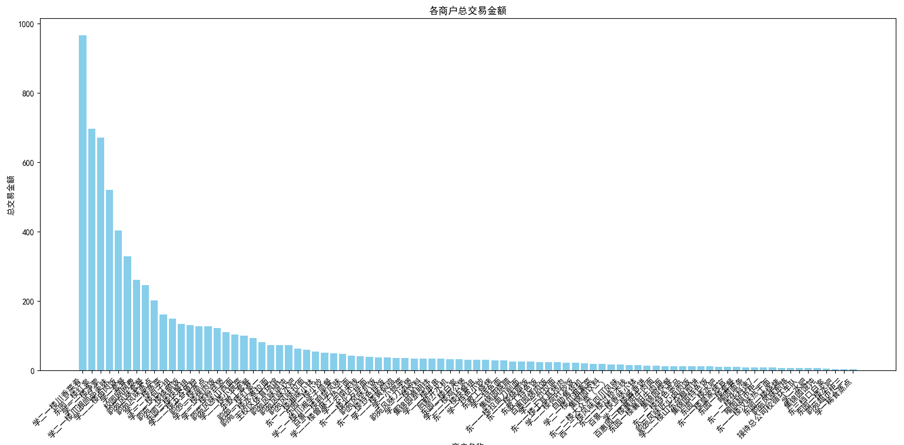
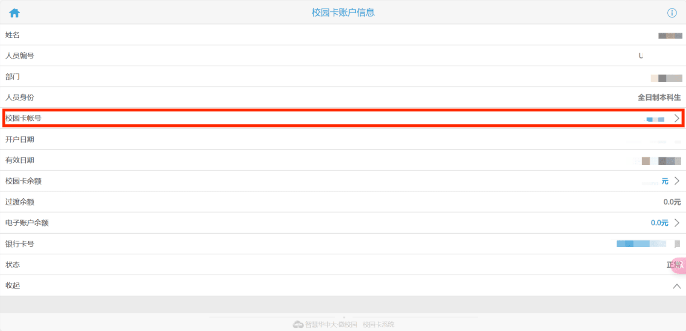
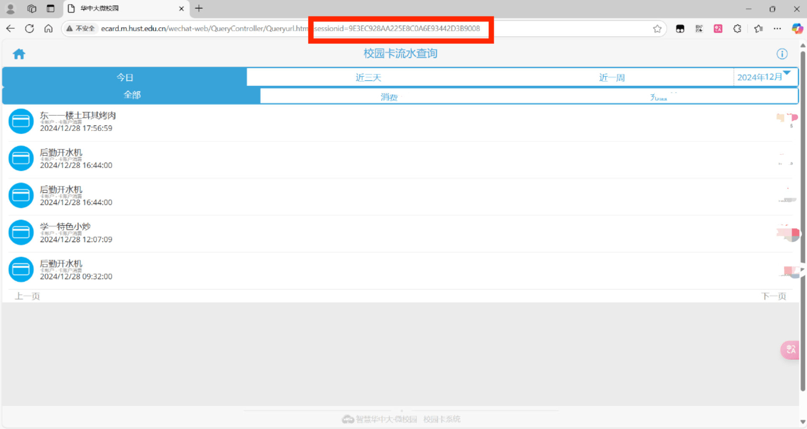

# HUST校园卡消费年终总结

## 概述

HUST校园卡消费年终总结是一个基于Python的脚本，旨在帮助用户分析和汇总其在HUST（华中科技大学）校园卡上的消费记录。

本项目参考[THU-Annual-Eat](https://github.com/leverimmy/THU-Annual-Eat)，[XJTU-Annual-Eat](https://github.com/wangerforcs/XJTU-Annual-Eat)，感谢原作者的贡献。



## 使用方法

### 环境准备

- Python环境（建议使用Python 3.6及以上版本），在终端安装如下库。

  ```bash
  pip install requests matplotlib
  ```

### 获取账号和JSESSIONID

登录企业微信-华中大微校园

在校园卡账户信息获取校园卡账号`account`




使用浏览器打开进入流水查询在网址处获取`JSESSIONID`(过一段时间会发生变化)



### 运行

```bash
python main.py
```

输入`account`和`JSESSIONID`

等待绘制结果

## 总结

项目仅简单实现了可视化年终消费情况的功能，但可扩展性强。网络请求返回结果还可以用于其他统计分析。感兴趣的同学可以扩展此项目的功能。